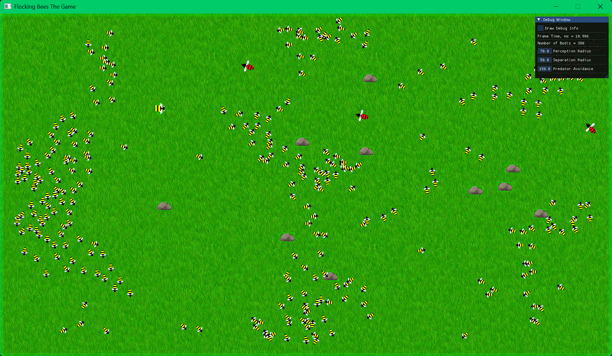

# Flocking Bees The Game
This is a modification of the Flocking Bees project, so now it has the Engine base and can have a lot more features (like physics and data structures).

### Flocking algorithm features:
* random spawning of a few hundred boids and a few predators
* boids and predators are Entities with sprites and rigidbodies
* walls and predators avoidance
* predators avoid each other
* optimized calculations
* a few tunable parameters--weights of alignment, cohesion and separation, speed, separate perception, separation and predator avoiadance radii (or radiuses)
* checkbox that allows to enable/disable drawing some debug info for the boids and predators
* frame time in the window and console

# Setup
Simply run the Scripts/Setup.bat to generate project files and VS solution file.

*Based on the Game Template repository*